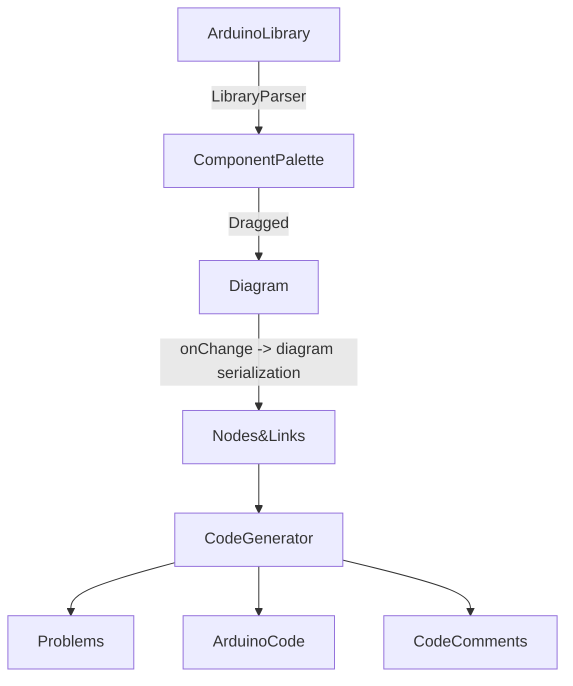

# MDD4CPD
:warning: This project has moved to a [new repository](https://github.com/GSEKM/MDD4CPD), due to a tech stack and collaborator change.

## Tool Architectural Flow

```mermaid
graph TD;
    ArduinoLibrary-->|LibraryParser|ComponentPalette-->|Dragged|Diagram-->|onChange -> diagram serialization|Nodes&Links-->CodeGenerator-->Problems;
    CodeGenerator-->ArduinoCode;
    CodeGenerator-->CodeComments;
```
