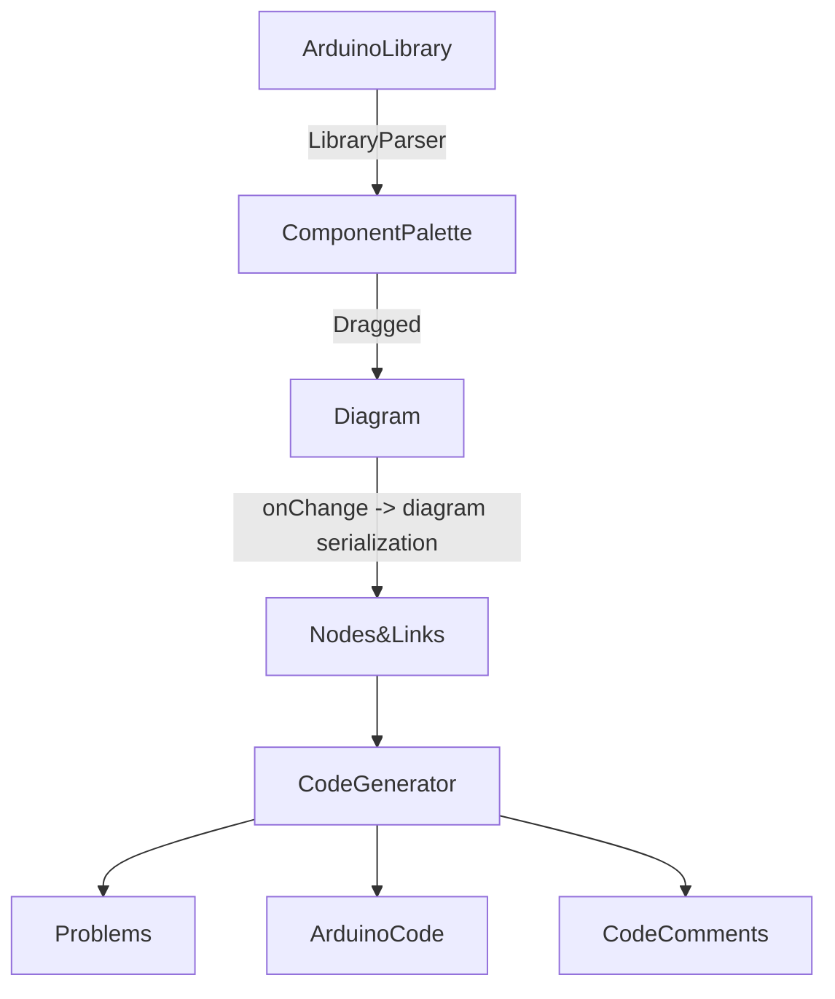

# MDD4CPD
Model Driven Methodology For Cyber-Physical Devices

More info about this here: https://dl.acm.org/doi/abs/10.1145/3535511.3535542

## Tool Architectural Flow

## Master's Thesis

[Document is hosted here](documents/thesis.pdf)